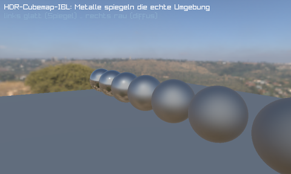
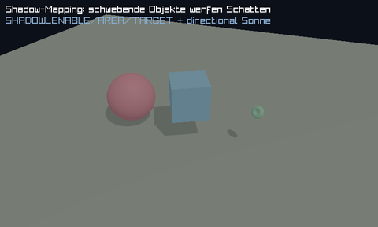
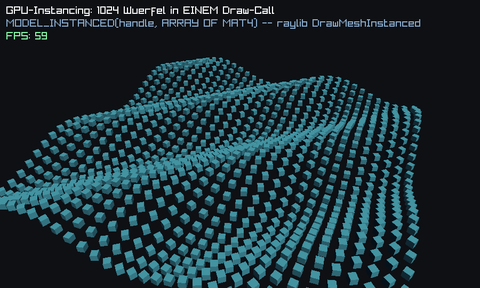
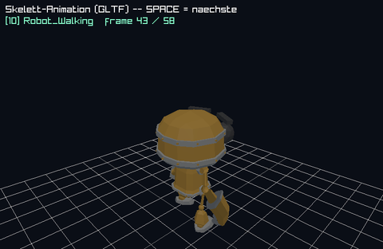
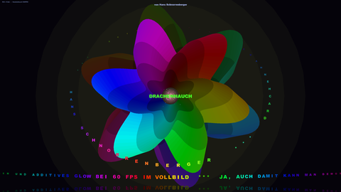
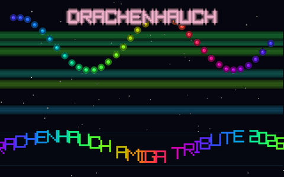
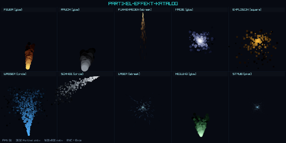
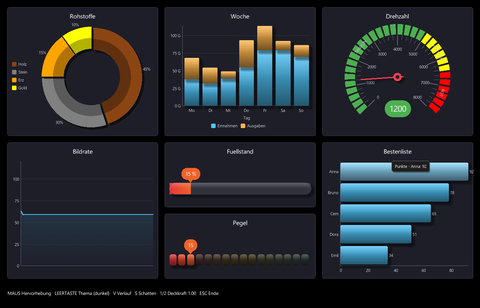
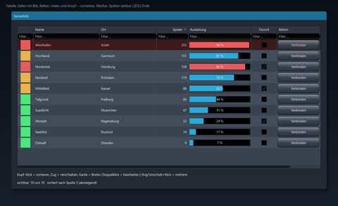

<p align="center">
  
</p>

<p align="center"><strong>Feuer frei für deine Ideen.</strong></p>

<p align="center"><em>Deutsch · <a href="README.en.md">English</a></em></p>

Ein BASIC-Dialekt mit Pascal-strikter Typisierung und OOP, ausgelegt für Spiele. Programme laufen über **`dhrt`** — die native Rust-Runtime, die Quelltext selbst lext, parst, kompiliert und ausführt. Grafik und 3D über **raylib**, Ton über **[Kira](https://github.com/tesselode/kira)** auf einem eigenen Audio-Thread. Python ist nur noch Editor-/Tooling-Schicht.

```basic
IMPORT "sprite"
IMPORT "particles"

SCREEN(320, 240, "Hallo Welt", 2)

DIM held AS SPRITE
held = SPRITE_NEW(LOADIMAGE("assets/hero.png"), 16, 16)
SPRITE_SET_POS(held, 100.0, 100.0)

WHILE NOT QUITREQUESTED()
    CLS()
    SPRITE_DRAW(held)
    FLIP()
    SLEEP(16)
WEND
```

## Was damit geht

<table>
<tr>
<td width="33%" align="center"><a href="examples/99_ibl_hdr.dh"></a><br><b>HDR-Beleuchtung</b><br><sub>Metalle spiegeln eine echte Umgebung</sub></td>
<td width="33%" align="center"><a href="examples/93_shadows.dh"></a><br><b>Schatten</b><br><sub>Tiefenpuffer mit weichen Kanten</sub></td>
<td width="33%" align="center"><a href="examples/104_instancing.dh"></a><br><b>GPU-Instancing</b><br><sub>1024 Würfel in einem Draw-Call</sub></td>
</tr>
<tr>
<td align="center"><a href="examples/108_skeletal_anim.dh"></a><br><b>Skelett-Animation</b><br><sub>geriggtes GLTF, Posen überblendet</sub></td>
<td align="center"><a href="examples/119_vortex.dh"></a><br><b>Additives Blenden</b><br><sub>Vollbild bei 60 Bildern je Sekunde</sub></td>
<td align="center"><a href="examples/65_amiga_demo.dh"></a><br><b>Demoszene</b><br><sub>Copper-Bars und Sinus-Scroller</sub></td>
</tr>
<tr>
<td align="center"><a href="examples/78_particle_catalog.dh"></a><br><b>Partikel</b><br><sub>fünf Render-Modi, Farbverläufe</sub></td>
<td align="center"><a href="examples/154_chart.dh"></a><br><b>Diagramme</b><br><sub>sechs Arten, Maus und Tooltip inklusive</sub></td>
<td align="center"><a href="examples/157_gui_tabelle.dh"></a><br><b>Oberflächen</b><br><sub>sortier- und filterbare Tabelle</sub></td>
</tr>
</table>

Alle neun sind mitgelieferte Beispiele — ein Klick aufs Bild führt zum Quelltext.
Die Entwicklungsumgebung zeigt dieselbe Galerie mit **21 Demos** auf ihrer
Startseite, jede per Doppelklick startbar.

### Und außerdem: alles andere

Drachenhauch fing als Spiele-BASIC an. Inzwischen schreibt man damit auch die
Dinge, die *neben* dem Spiel anfallen — Werkzeuge, Auswertungen, kleine
Dienste:

| | |
|---|---|
| **Betriebssystem** | Dateien und Ordner, Umgebungsvariablen, `SHELL`, Exit-Codes, Argumente — ein `.dh`-Skript ist ein vollwertiges Kommandozeilen-Programm |
| **Netz** | `HTTP_GET`/`POST` mit Kopfzeilen und JSON, TLS, dazu `SHA256$`, `HMAC_SHA256$` und `UUID4$` für angemeldete Dienste |
| **Daten** | SQLite, CSV nach RFC 4180, ZIP, JSON, Regex, `BUFFER` für Binärdateien |
| **Größere Programme** | Namensräume (`IMPORT "mathe.dh" AS mathe`), `PRIVATE`, `TRY`/`CATCH`/`FINALLY` mit Fehler-Codes, Vererbung mit `SUPER` und `ABSTRACT`, Typtest zur Laufzeit (`x IS Hund`, `TYPEOF`), `ASSERT_EQ` |
| **Objekte als Rückrufe** | `obj.methode` ist eine `FUNCREF`, die ihre Instanz mitträgt — `GUI_ON_CLICK(knopf, spieler.klick)`, `TIMER_EVERY(500, gegner.zucken)`, `SORT(zahlen, regel.cmp)` |
| **Nebenher** | HTTP, Datenbank, fremde Programme und **eigene Funktionen** im Hintergrund (`TASK_START`) — die Hauptschleife läuft weiter |

Nichts davon braucht ein Fenster. Ein Drachenhauch-Programm kann eine
Konsolenanwendung sein, ein Cron-Job oder ein Spiel — dieselbe Sprache.

Nachzulesen im [Handbuch](docs/README.md); wie es dazu kam, steht in der
[Allzweck-Roadmap](docs/allzweck-roadmap.md).

## Herunterladen

**[Drachenhauch für Windows herunterladen](https://github.com/HasoSchno70/Drachenhauch/releases/latest)** — ein Installer, rund 87 MB, aktuell Fassung 2026.11.

Python muss dafür **nicht** installiert sein. Mit dabei sind die komplette Entwicklungsumgebung, die Runtime `dhrt`, alle 201 Beispiele samt Assets, beide Bücher (*Der Einstieg* und *Das Lehrbuch*, letzteres in beiden Sprachen) als `.docx` und `.epub` sowie das ESP32-Grundgerüst. Windows 64-Bit; die Datei ist nicht signiert, SmartScreen meldet sich also beim ersten Start.

## Aus dem Quelltext arbeiten

Einmalig einrichten (Python ≥ 3.12; `.venv/` ist gitignoriert, ein frischer
Klon hat es also nicht):

```
py -3.12 -m venv .venv
.venv\Scripts\python.exe -m pip install -r requirements.txt
```

Danach:

```
.venv\Scripts\python.exe dhrun.py            # Editor öffnen
.venv\Scripts\python.exe dhrun.py datei.dh   # Programm direkt ausführen
```

## Das Lehrbuch

**[Drachenhauch — Das Lehrbuch](buch-referenz/buch/)** ist beides zugleich: ein Kurs, der vom ersten schwarzen Fenster bis zu Klassen, Modulen und fertigen Spielen führt, und ein Nachschlagewerk, in dem **jeder einzelne Befehl** mit einem lauffähigen Beispielprogramm erklärt wird. Sieben Teile, 75 Kapitel, alle Codebeispiele gegen `dhrt --check` verifiziert.

| Ausgabe | Zum Drucken (A4) | Fürs Lesegerät |
|---|---|---|
| **Deutsch** — 414 Seiten | [Drachenhauch-Lehrbuch.docx](buch-referenz/buch/Drachenhauch-Lehrbuch.docx?raw=1) | [.epub](buch-referenz/buch/Drachenhauch-Lehrbuch.epub?raw=1) |
| **English** — 408 pages | [Drachenhauch-Handbook.docx](buch-referenz/buch/Drachenhauch-Handbook.docx?raw=1) | [.epub](buch-referenz/buch/Drachenhauch-Handbook.epub?raw=1) |

Beide Sprachen entstehen aus **denselben** Kapitelquellen (`content/NN_*.js`): die Renderer bekommen ein `H`, das jede Zeichenkette vorher durch den Katalog `i18n/en.json` schickt. Ein zweiter Satz englischer Kapiteldateien wäre binnen eines Monats vom deutschen abgedriftet — so kann er es nicht. Fehlt ein Eintrag, bleibt der deutsche Satz stehen und das Buch baut trotzdem; `node fehlend.js en` zählt, wo noch welche fehlen.

```
node build_book.js [--lang en]        # -> .docx (A4, zum Drucken)
node build_epub.js [--lang en]        # -> .epub (fließt in die Schriftgröße des Lesers, Nachtmodus)
<venv>\python.exe make_book.py [--lang en]   # Zwei-Pass-Build mit Seitenzahlen im Inhalt
```

## Handbuch

Vollständige Doku im [docs/](docs/README.md)-Ordner:

- **[Sprachreferenz](docs/sprache.md)** — Variablen, Typen, `ENUM`, `SELECT CASE`, Funktionen mit Defaults und Named Arguments, Klassen, Try/Catch, f-Strings, Coroutines (`YIELD` + `CORO_*`)
- **[Standard-Built-ins](docs/builtins-core.md)** — Math, Strings, Maps, File-I/O, …
- **[Grafik-Built-ins](docs/builtins-grafik.md)** — native Runtime (dhrt/raylib), Z-Layer, Sprite-Atlas, Asset-Preloader
- **[Performance](docs/PERFORMANCE.md)** — Bench-Zahlen + umgesetzte Optimierungen (Spec-Ops, IC, Typed Arrays, ECS Bulk-Ops, …)
- **Module** — 47 Stück, [Tabelle unten](#module)
- **[Code-Editor](docs/editor.md)** — Tastenkürzel, Snippets, Minimap, Multi-Cursor, Sidebar, Run/Bench, Signature-Help, **Breadcrumbs** (Scope-Pfad), **Peek-Definition** (Alt+F12), **Split-View** (Strg+\\), **Debugger** (Breakpoints inkl. **bedingter** Breakpoints/Step/Variablen), **Profiler** (Hotpath pro Zeile/Funktion), **Git-Blame**-Panel, Welcome-Showcase (Demo-Galerie mit Screenshots)
- **[Sprite-Editor](docs/sprite-editor.md)** — Pixel-Art-Editor (`dhsprites`): Multi-Frame, **Ebenen** (Sichtbarkeit/Deckkraft/Merge-Down, `.dhsprite` v5), Animation, Atlas-Export, **Export-Skalierung** (1x–8x, Nearest-Neighbor), **Lasso-Auswahl** (echte Pixel-Maske) + Rechteck-Auswahl, Onion-Skin (Deckkraft/Reichweite einstellbar), Tile-Preview
- **[Partikel-Editor](docs/particle-editor.md)** — Effekt-Editor (`dhparticles`): Emitter-Parameter live tunen mit Echtzeit-Vorschau, **Preset-Bibliothek** (Werks- + eigene Presets), GB-Code-Export
- **[Audio Studio](docs/tracker.md#audio-studio)** — vereint Tracker + SFX-Generator in **einem fullscreen Fenster** mit Reitern (`dhsound` / `dhrun.py --audio`; `dhsfx`/`dhtracker` öffnen denselben auf dem passenden Tab). `F11` Vollbild, `Strg+1/2` Tabwechsel.
- **[SFX-Generator](docs/sfx-generator.md)** — Retro-Soundeffekte (sfxr-Stil, SFX-Tab): Synth mit Pitch-Slide/Hüllkurve/Vibrato/Stereo, **SID-Charakter** (Pulsbreite/PWM + resonanter Filter-Sweep), **Preset-Bibliothek** (eigene Sounds speichern), Export WAV/GB-Code (`AUDIO_SFX`)
- **[Tracker](docs/tracker.md)** — mehrspuriger Musik-Editor (Tracker-Tab), [Tabelle unten](#tracker)
- **[Notenblatt-Editor](docs/score-editor.md)** — echte Notensatz-Darstellung (`dhscore`): Noten per Klick auf ein 5-Linien-System setzen (Violin-/Bassschlüssel, Hilfslinien, Vorzeichen), Notendauern (ganze/halbe/Viertel/Achtel/Sechzehntel + punktiert + Pause), ein Instrument pro Spur, Wiedergabe über den geteilten additiven Mixer, eigenes `.json`-Format **oder** direkter Export/Öffnen im Tracker (`dhtracker`)
- **[Tilemap-/Level-Editor](docs/tilemap-editor.md)** — Tiles aufs Gitter malen (`dhtilemap`): mehrere Layer, Object-Layer, **mehrere Tilesets**, Per-Tile-Properties (`solid`/`damage`), Stift/Füllen/Rechteck/Pipette/**Auswahl** (Copy/Cut/Paste), Speichern/Laden als Tiled-JSON (`TILED_LOAD`), GB-Code-Renderer-Export
- **[Form-Designer (WYSIWYG)](docs/form-designer.md)** — visueller GUI-Designer im Xojo-Stil (`dhform`): Controls platzieren/konfigurieren, als `.dhform` speichern, per `GUI_LOAD` im eigenen Code nutzen oder mit F5 starten
- **[Animations-FSM-Editor](docs/anim-editor.md)** — Knoten-Graph für Animation-State-Machines im Unity-Mecanim-Stil (`dhanim`): States (an Sprite-Anim gebunden) + Parameter + Transitions mit Bedingungen visuell verdrahten, als `.dhanim` speichern, per `ANIM_FSM_LOAD` ([Modul `animfsm`](docs/module-animfsm.md)) nutzen, Live-Vorschau mit F5
- **[Language Server + VSCode-Extension](docs/lsp.md)** — Drachenhauch in jedem LSP-Editor: Syntax-Highlighting, Diagnostics, Completion, Hover, Goto-Definition, References, Outline (`py -m drachenhauch.lsp`, `vscode-drachenhauch/`)
- **[Web-Playground](docs/web-playground.md)** — `dhrt` als WebAssembly im Browser, [Tabelle unten](#web-playground)
- **[`cloud`-Modul](docs/module-cloud.md)** — Cloud-Save + Leaderboard gegen den mitgelieferten, selbst hostbaren Referenz-Server [`cloudserver/`](cloudserver/README.md) (Flask + SQLite, geteiltes API-Key-Secret): `CLOUD_CONFIGURE`/`CLOUD_SAVE`/`CLOUD_LOAD`, `LEADERBOARD_SUBMIT`/`LEADERBOARD_FETCH`. Plus **`NUMFMT$`** (core-Builtin) für Idle-/Incremental-Game-taugliche Big-Number-Formatierung (`1234567` → `"1.23M"`, K/M/B/T/Qa/Qi/Sx/Sp/Oc/No/Dc, danach wissenschaftliche Notation). Demo [examples/146_cloud_idle.dh](examples/146_cloud_idle.dh)
- **[ESP32 / ESP8266 anbinden](esp32/README.md)** — fertiges Sketch-Grundgerüst (WLAN, Broker-Verbindung, Wiederverbinden, Empfang) mit vier markierten Stellen für eigenen Code; **eine Datei für beide Boards**, übersetzt für ESP32/ESP8266/ESP32-C3/ESP32-S3. Redet über [`mqtt`](docs/module-mqtt.md) mit dem Drachenhauch-Gegenstück [examples/159_esp32_bruecke.dh](examples/159_esp32_bruecke.dh) — das sich mit `mosquitto_pub` auch **ohne Board** fertig entwickeln lässt

### Module

47 Module, per `IMPORT "name"` verfügbar. Jedes hat eine eigene Seite unter
[docs/](docs/README.md#module).

**Spiel-Bausteine**

| Modul | Wofür |
|---|---|
| [`sprite`](docs/module-sprite.md) | animierte Sheet-Sprites: Position, Velocity, benannte Animationen, Kollision |
| [`animfsm`](docs/module-animfsm.md) | Animations-Zustandsautomat im Unity-Mecanim-Stil, aus `.dhanim` (Editor `dhanim`) |
| [`camera`](docs/module-camera.md) | Weltverschiebung, Zoom und Drehung für **alle** Zeichenbefehle; Folgen, Bildschirm↔Welt |
| [`controller`](docs/module-controller.md) | Figuren-Steuerung mit Coyote-Zeit, Sprung-Puffer und variabler Sprunghöhe |
| [`scene`](docs/module-scene.md) | Szenen-Stapel (`PUSH`/`POP`/`SWITCH`) mit Daten pro Szene |
| [`save`](docs/module-save.md) | Speicherstände als JSON, mit Versionsfeld |
| [`input`](docs/module-input.md) | benannte Aktionen statt Tastencodes, Flankenerkennung, Gamepad |
| [`timer`](docs/module-timer.md) | geplante Aktionen (`TIMER_AFTER`/`EVERY`) + `COOLDOWN`-Ratenbegrenzer |
| [`tween`](docs/module-tween.md) | Werte weich überführen, 13 Verlaufskurven |
| [`curves`](docs/module-curves.md) | Bézier, Catmull-Rom, Hermite, Smoothstep — reine Funktionen |
| [`astar`](docs/module-astar.md) | A*-Wegfindung auf einem Kachelgitter |
| [`ecs`](docs/module-ecs.md) | Entity-Component-System mit Massen-Operationen für heiße Schleifen |

**Physik und Mathematik**

| Modul | Wofür |
|---|---|
| [`physics`](docs/module-physics.md) | reine Kollisionsmathematik: Rechteck/Kreis/Strahl/Strecke/Polygon, kein Zustand |
| [`physics2d`](docs/module-physics2d.md) | **echte** 2D-Starrkörper (Rapier2D): Schwerkraft, Stapeln, Werfen, Rollen — [Demo](examples/112_physics2d.dh) |
| [`physics3d`](docs/module-physics3d.md) | dasselbe in 3D (Rapier3D) — [Demo](examples/107_physics3d.dh) |
| [`vec2`](docs/module-vec2.md) | 2D-Vektor mit überladenen Operatoren, unveränderlich |
| [`m3d`](docs/module-m3d.md) | VEC3/VEC4/QUAT/MAT4, Quaternionen, Matrizen; GPU-Instancing über `MODEL_INSTANCED` |

**Grafik und Klang**

| Modul | Wofür |
|---|---|
| `g3d` | 3D: Kamera, Modelle (OBJ/GLTF), Skelett-Animation, PBR, HDR-IBL, Schatten, Normal-Maps, Picking — siehe [Grafik-Built-ins](docs/builtins-grafik.md) |
| [`particles`](docs/module-particles.md) | Partikel-Emitter mit Schwerkraft, Farbverlauf über die Lebenszeit, fünf Zeichenarten |
| [`imgfx`](docs/module-imgfx.md) | Bilder skalieren, drehen, spiegeln, einfärben — auch kantentreu für Pixelgrafik |
| [`audio`](docs/module-audio.md) | auf **Kira**: Kanäle, Busse, Echtzeit-Effekte (Filter/Hall/Echo/Verzerrer/Kompressor/EQ), Synthese, Sampler, `.mod`/`.xm`-Wiedergabe, Musik anspringen (`AUDIO_MUSIC_SEEK`), räumliches Audio, taktgenaue Uhr. [Modulatoren](docs/module-audio-modulatoren.md) laufen auf dem Audio-Thread weiter, auch wenn die Bildrate einbricht Einen Klang **anschauen und sichern**: `AUDIO_SOUND_WAVE` (Kurve zum Zeichnen) und `AUDIO_SAVE_WAV`. |

**Oberfläche**

| Modul | Wofür |
|---|---|
| [`gui`](docs/module-gui.md) | 24 Widget-Arten mit bleibendem Zustand — darunter eine **professionelle Tabelle** (sortieren, filtern, feste und umsortierbare Spalten, Zellen bearbeiten). Plastische Glas-Themen, Kippschalter, Drehregler, 9-Slice-Skins. **Vollstaendig ohne Maus bedienbar** (TAB durch alle Widgets, Fokus-Ring), **`GUI_SCALE`** fuer hochaufloesende Bildschirme und modale Dialoge im eigenen Thema. [Alle Widgets](examples/156_gui_alle_widgets.dh) · [Tastatur/Massstab/Dialog](examples/182_gui_tastatur_massstab.dh) · [Tabelle](examples/157_gui_tabelle.dh) · [an SQLite](examples/158_gui_tabelle_sqlite.dh) Das mehrzeilige Textfeld ist ein **Code-Feld**: Syntax-Einfaerbung ueber `SYNTAX_SPANS`, Zeilennummern, aktive Zeile, Tabulator. Eigene Schrift fuer die ganze Oberflaeche (`SETFONT`); bei grossen Dateien faerbt `GUI_TEXTAREA_VIEW` nur den sichtbaren Ausschnitt (30.000 Zeilen: 272 ms -> 2,1 ms je Anschlag). Dazu **Farbwaehler** und **Datumswaehler**. |
| [`ui`](docs/module-ui.md) | dasselbe als Immediate-Mode: kein Aufbau, alles pro Bild neu gezeichnet |
| [`chart`](docs/module-chart.md) | sechs Diagrammarten (Kuchen, Balken, Linie, Tacho, Leiste, LED-Kette), vier Themen, Maus-Interaktion — [Demo](examples/154_chart.dh) |

**Daten**

| Modul | Wofür |
|---|---|
| [`json`](docs/module-json.md) | JSON lesen/schreiben, Pfad-Zugriff (`"user.name"`, `"items.0"`) |
| [`db`](docs/module-db.md) | SQLite mit `?`-Platzhaltern und Transaktionen |
| [`regex`](docs/module-regex.md) | Muster suchen, ersetzen, trennen |
| [`tiled`](docs/module-tiled.md) | Karten aus dem Tiled-Editor laden, inklusive Objekte und Eigenschaften |
| [`tile_collide`](docs/module-tile-collide.md) | Kasten-gegen-Kachelkarte, achsenweise — klassische Plattformer-Physik |
| [`cloud`](docs/module-cloud.md) | Spielstand und Bestenliste gegen den mitgelieferten Server [`cloudserver/`](cloudserver/README.md) |
| [`ini`](docs/module-ini.md) | Einstellungsdateien, die ein Mensch bearbeiten kann — gelesen wird eine `MAP` |
| [`xml`](docs/module-xml.md) | XML aus fremden Systemen lesen, mit Pfad-Navigation |
| [`geld`](docs/module-geld.md) | ein Betrag als eigener Wert: exakt, nicht mit Zahlen vermischbar, teilt ohne Cent-Schwund |

**Etwas abgeben**

| Modul | Wofür |
|---|---|
| [`pdf`](docs/module-pdf.md) | druckfertige Seiten: Rechnung, Lieferschein, Bericht, Etikett — in Millimeter gesetzt, ohne eingebettete Schriften |
| [`xlsx`](docs/module-xlsx.md) | Auswertungen als Excel-Mappe: mehrere Blätter, fette Kopfzeile, Zahlen- und Datumsformate |
| [`smtp`](docs/module-smtp.md) | die Auswertung per E-Mail rausschicken: Text und HTML, Anhänge, STARTTLS/TLS |

**Netz, Hardware, Basteln**

| Modul | Wofür |
|---|---|
| [`net`](docs/module-net.md) | TCP und UDP, von Haus aus nicht blockierend — friert den Spielablauf nicht ein |
| [`html`](docs/module-html.md) | HTTP GET/POST/Download + HTML auslesen |
| [`httpd`](docs/module-httpd.md) | die andere Richtung: ein kleiner Webserver im Takt der Hauptschleife — Bedienoberfläche im Heimnetz |
| [`mqtt`](docs/module-mqtt.md) | das Pub/Sub-Protokoll der IoT-Welt — der Weg zum ESP32 **über WLAN** |
| [`firmata`](docs/module-firmata.md) | Arduino-/ESP32-Pins direkt schalten, ohne eigenen Sketch |
| [`serial`](docs/module-serial.md) | rohe COM-Verbindung für eigene Protokolle |
| [`usb`](docs/module-usb.md) | USB-HID: Bastelboards, Programmieradapter, eigene Controller |
| [`midi`](docs/module-midi.md) | Noten von einem angeschlossenen Instrument lesen und welche hinausschicken |
| [`bt`](docs/module-bt.md) | Bluetooth Low Energy: scannen, verbinden, Charakteristiken lesen/schreiben |
| [`wifi`](docs/module-wifi.md) | Netze suchen, verbinden, Signalstärke |

Ein fertiges Sketch-Grundgerüst fürs Board liegt in **[esp32/](esp32/README.md)**.

### Tracker

Der mehrspurige Musik-Editor im [Audio Studio](docs/tracker.md) — ein Tracker
in der Tradition von ProTracker, FastTracker und Renoise.

**Spuren**

| | |
|---|---|
| Kanalzahl | 4–32 einstellbar, der letzte ist immer der Schlagzeug-Kanal |
| Akzentfarbe je Kanal | Kopfzeile, Noten, Aussteuerung und Regler übernehmen sie |
| Mixer-Fader | echter Lautstärkeregler pro Spur — wirkt beim Vorhören, in der WAV und im erzeugten GB-Code |

**Instrumente**

| | |
|---|---|
| Bibliothek | Flügel, Orgel, Streicher, Bass, Glocke … und Schlagzeug; ein Klang pro Spur als Vorgabe |
| Instrument **pro Note** | ein Kanal ist nur ein Stimmen-Platz: jede einzelne Note darf ihr eigenes Instrument mitbringen (`Instr:`-Auswahl) |
| Sample-Instrumente | WAV/OGG laden und über die ganze Klaviatur resampeln (MOD/XM/IT-Prinzip), mit grafischem Schleifen-Editor und Panorama-Regler |
| Keymap / Multisample | verschiedene Samples auf Tastenbereiche verteilen — auch als Schlagzeug-Satz |
| SoundFont | `.sf2` einlesen: echte GM- und Hersteller-Instrumente |

**Bearbeiten**

| | |
|---|---|
| Patterns | mehrere, jeweils eigene Länge, zu einem Song angeordnet |
| Block-Auswahl | Kopieren, Ausschneiden, Einfügen, Transponieren, Zwischenwerte berechnen |
| Effekt-Spalten | Lautstärke, Tonhöhen-Gleiten/Portamento, Arpeggio, Vibrato, Retrigger, Sample-Versatz — je Note, dazu Instrument-Panorama |
| Note-Off | eine Note gezielt vor der nächsten abschneiden |

**Ausgabe**

| | |
|---|---|
| Projekt | speichern und laden als `.json` |
| GB-Player | Export als bildweise abgespielter Drachenhauch-Code |
| WAV | Song offline gemischt, **Stereo mit Amiga-Hard-Panning** → direkt für `PLAYMUSIC` |

### Web-Playground

`dhrt` läuft als WebAssembly im Browser — nicht als abgespeckte Fassung,
sondern als dieselbe Runtime. Quelle ins Textfeld tippen, starten, fertig.
Ausführlich in [docs/web-playground.md](docs/web-playground.md).

| Was im Browser läuft | Wie |
|---|---|
| Übersetzen | dhrt kompiliert die Quelle **selbst im Browser** — kein Pyodide, kein Server |
| Konsole und Grafik | beides gleichzeitig; der Zeichen-Ablauf gibt pro Bild ab (ASYNCIFY), damit `WHILE … FLIP() … WEND` den Reiter nicht einfriert |
| Ton | ein eigenes Kira-Backend schiebt den fertigen Mix in OpenAL-Puffer, die emscripten auf WebAudio abbildet; die Warteschlange taktet sich von selbst in Echtzeit. Browser lassen Klang erst nach dem ersten Klick zu |
| 3D | WebGL 2 — dessen GLSL ES 3.00 ist bis auf den Kopf identisch zum Desktop-GLSL. PBR, HDR-IBL, Skybox, Schatten, Instancing und Post-Effekte sind im Browser nachgewiesen |
| Dateien | ein `assets/`-Ordner neben der `.dh` kommt als `dhrt.data` mit — Bilder, Schriften und Musik liegen unter denselben Pfaden wie auf dem Desktop |
| Teilbare Links | die Quelle steckt im URL-Anker: Link öffnen heißt sehen **und** starten |

Gebaut wird mit `rust/build_wasm.py`, das Gerüst liegt in `web/`.

## Beispiele

`examples/` enthält 162 Beispiele plus zehn Benchmarks, von "Hallo Welt" bis zum kompletten Mini-Spiel:

| Datei | Zeigt |
|---|---|
| `01_hello.dh` … `09_shapes.dh` | Sprach-Grundlagen |
| `10_pong.dh`, `22_tetris.dh`, `23_platformer.dh` | komplette Spiele |
| `24_json.dh` … `33_ui.dh` | jedes Modul mit Demo |
| `32_coinquest.dh` | Mini-Spiel mit Modulen + SELECT CASE |
| `49_pong_scene.dh` | Pong, strukturiert mit `scene` + `save` (Highscore) |
| `50_enum.dh` | ENUM in Compact- und Block-Form |
| `51_astar.dh` | A*-Pathfinding mit ASCII-Render |
| `52_named_args.dh` | Named Arguments in SUB/FUNCTION/NEW |
| `73_ecs_bullets.dh` | ECS mit pro-Entity-Loop (klassisches Pattern) |
| `75_preloader.dh` | `LOAD_ASSETS` — alle Bilder/Sounds aus einem Manifest |
| `76_layers_atlas.dh` | Z-Layer + Sprite-Atlas: 600 Tiles aus einem Atlas, in Z-Reihenfolge zusammengesetzt |
| `77_tiled_platformer.dh` | **Mini-Platformer**: Tiled-Level + Atlas + Tile-Kollision + Z-Layer + Input-Mapping |
| `98_coroutines.dh` | **Coroutines/YIELD**: Generatoren, `FOR EACH`-Drain, send/return-Dialog, `CORO_RESULT`, Methoden-Coroutine |
| `154_chart.dh` | **Diagramme**: alle sechs Arten, Themen, Maus-Interaktion |
| `156_gui_alle_widgets.dh` | **alle 22 GUI-Widgets** in einer Vollbild-Anwendung, jedes mit echter Aufgabe |
| `186_farbe_und_datum.dh` | **Farbwaehler und Datumswaehler** — zwei neue Widget-Arten, beide ohne Maus bedienbar |
| `185_partikel_editor.dh` | **der Partikel-Editor, geschrieben IN Drachenhauch** — 17 Regler, echte Vorschau, GB-Code-Export |
| `184_codefeld.dh` | **das TEXTAREA als Code-Feld** — Syntax-Einfaerbung, Zeilennummern, aktive Zeile, Tabulator |
| `183_sfx_generator.dh` | **der SFX-Generator, geschrieben IN Drachenhauch** — 16 Regler, Wellenform-Anzeige, WAV-Export; das Gegenstueck zum Qt-Werkzeug `dhsfx` |
| `182_gui_tastatur_massstab.dh` | **Bedienung ohne Maus**, `GUI_SCALE` fuer HiDPI und ein modaler Dialog im eigenen Thema |
| `157_gui_tabelle.dh`, `158_gui_tabelle_sqlite.dh` | **professionelle Tabelle** — sortieren, filtern, Zellen bearbeiten; die zweite an einer echten SQLite-Datenbank |
| `159_esp32_bruecke.dh` | **ESP32 anbinden** — Messwerte empfangen, Befehle zurückschicken (Sketch in [esp32/](esp32/)) |
| `160_musik_seek.dh` | **Musik anspringen** (`AUDIO_MUSIC_SEEK`) — klickbarer Fortschrittsbalken, ±10 s, und der Vorlauf, den ein Sprung erst leerspielt |
| `161_werkzeug.dh` | **Ein Werkzeug statt eines Spiels** — Kommandozeilenargumente, Meldungen nach stderr, Rückgabewert; zählt Zeilen/Wörter/Zeichen wie `wc` |
| `162_binaerdatei.dh` | **Binärdaten lesen** (`BUFFER`) — Breite/Höhe und Blockliste aus einer echten PNG-Datei, ohne Bildbibliothek; dazu ein eigenes Dateiformat schreiben und einlesen |
| `163_rest_api.dh` | **REST-Schnittstelle bedienen** (`HTTP_REQUEST`) — Token in der Kopfzeile, PUT/DELETE, JSON, und eine Bild-Antwort als rohe Bytes |
| `164_signatur.dh` | **Signaturen und Tokens** (`HMAC_SHA256$`, `RANDOM_BYTES`) — einen Webhook prüfen, einen Schlüssel würfeln, eine Datei-Prüfsumme nachrechnen |
| `165_pruefen.dh` | **Ein Programm, das sich selbst prüft** (`ASSERT_EQ`) — Sammel-Modus, Bilanz und ein Rückgabewert, den ein Skript auswerten kann |
| `166_aufraeumen.dh` | **Aufräumen und entscheiden** (`FINALLY`, `ERROR_CODE$`) — eine Datei, die auf jeden Fall geschlossen wird; ein `CATCH`, das am Code entscheidet statt am Meldungstext |
| `167_vererbung.dh` | **Vererbung ohne Wiederholung** (`SUPER`, `ABSTRACT`) — eine Basisklasse rechnet mit Methoden, die erst ihre Unterklassen schreiben |
| `168_hintergrund.dh` | **Arbeiten lassen ohne stehenzubleiben** (`DB_QUERY_START`, `SHELL_START`) — große Abfrage und Kindprozess laufen, die Hauptschleife dreht sich weiter |
| `181_midi.dh` | **MIDI-Klaviatur** — was auf einem angeschlossenen Keyboard gespielt wird, leuchtet auf; ein Mausklick schickt die Note zurück an den Synthesizer |
| `bench_ecs_movement_v2.dh` | ECS-Bulk-API (`ECS_INTEGRATE_FLOAT`) — 40× schneller als pro-Entity-Loop |
| `bench_ecs_systems.dh` | Bullet-Hell-Pattern mit 8 Bulk-Systemen pro Frame |

## Architektur

Pipeline: **Source → Preprocessor → Lexer → Parser → Compiler → VM** — **alles in `dhrt`** (Rust). `dhrt run datei.dh` ist ein eigenständiger End-to-End-Lauf ohne Python. Korrektheit sichern **run_gb-Golden-Tests** (`assert run_gb(src) == expected`, spawnt `dhrt run`) + Rust-`#[test]`s.

> **Geschichte:** Früher liefen Programme zusätzlich über einen Python-**Tree-Walker** und zwei Python-**Bytecode-VMs** (Python-VM, Cython-VM), mit „bit-identischem Output" als Garantie. Seit **Stufe B** sind Tree-Walker + Python-Toolchain (interpreter/compiler/vm/serialize) **alle entfernt** — `dhrt` ist die einzige Runtime und kompiliert den Quelltext selbst.

**Native Rust-Runtime (raylib + Kira) — die einzige Runtime.** `dhrt` (`rust/drachenhauch_runtime/`)
lext, parst, kompiliert und führt den Quelltext selbst aus — ein eigenständiges
Rust-Frontend, kein Python im Ausführungspfad. Was davon nativ läuft:

| Bereich | Umfang |
|---|---|
| Sprache | Skalare, Strings, Arrays, Maps, Tupel, OOP (Klassen/Methoden/Properties/Operatoren), Slicing, Comprehensions, `TRY`/`THROW` und alle puren Built-ins |
| Coroutinen | `YIELD` über einen Frame-Schnappschuss statt Threads — sicher auf raylibs Hauptthread, von Bauart her vorhersagbar, auch in der eigenständigen `.exe` ([Demo](examples/98_coroutines.dh)) |
| 2D | Primitive, Text, Bilder, Eingabe; Z-Ebenen, Sprite-Atlas, Render-Ziele, Mischmodi, prozedurale Texturen |
| 3D | Kamera + Grundkörper ([Demo](examples/82_3d_intro.dh)), Modelle in OBJ/GLTF, prozedurale Netze bis zum Höhenfeld-Gelände, **Skelett-Animation** geriggter GLTF/IQM ([Demo](examples/108_skeletal_anim.dh)), Billboards, Strahl-Treffer und Maus-Auswahl — auch auf echter Fläche statt nur Hüllkörper ([Demo](examples/151_picking_flaechen.dh)) |
| Beleuchtung | physikalisch (Cook-Torrance), bis 4 Lichter, `MODEL_PBR` für Metall und Rauheit ([Demo](examples/95_pbr.dh)); Eigenleuchten ([Demo](examples/110_emissive_glow.dh)), Schlagschatten mit PCF ([Demo](examples/93_shadows.dh)), Normal-Maps ([Demo](examples/94_normalmap.dh)), Tiefennebel ([Demo](examples/92_fog.dh)) und Umgebungslicht — analytisch ([Demo](examples/96_ibl.dh)) wie als echte HDR-Cubemap ([Demo](examples/99_ibl_hdr.dh)) |
| Klang | **Kira** auf eigenem Audio-Thread (löste 2026-06-13 raylibs Audio ab): Klänge, Musik, `.mod`/`.xm` über einen reinen Rust-Abspieler |
| Oberfläche | `gui` mit 22 Widget-Arten (bleibender Zustand, Themen, Ziehen, Z-Reihenfolge, Fokus, FUNCREF-Rückrufe) und `ui` im Immediate-Mode |
| Bild und Ablauf | Spielschleife (`DELTA`/`FPS`/`SETFPS`), GPU-Shader und Nachbearbeitung (`SHADER_LOAD`/`POSTFX`), TTF-Schriften ([Demo](examples/87_ttf_fonts.dh)), Gamepad |
| Eingabe aufzeichnen | `AUTOMATION_RECORD`/`PLAY` für Demo-Modus, nachspielbare Fehlerberichte und automatische Spieltests ([Doku](docs/automation.md), [Demo](examples/153_automation.dh)) |
| Module | **alle** — auch die früher Python-eigenen: `regex`, `tiled`, `tile_collide`, `controller`, das erweiterte `audio`; dazu per Feature `db` (rusqlite), `net`, `mqtt`, `html` (ureq) und die Hardware-Seite `serial`, `firmata`, `usb`, `wifi`, `bt` |
| Ausliefern | `dhrun.py --export` (oder Strg+F6 im Editor) bündelt Bytecode + `assets/` zu einer eigenständigen `.exe`, die ohne Python läuft |

Damit braucht nur noch der Editor Python. Die schweren Module kommen mit
`build_runtime.py --hardware` bzw. `--full` dazu — **ein Bau ohne diese Schalter
lässt sie wieder weg**, was der häufigste Grund dafür ist, dass ein Hardware-Beispiel
plötzlich nicht mehr läuft. Ein Schaustück, das fast alles davon gleichzeitig zeigt:
[examples/97_pbr_reactor.dh](examples/97_pbr_reactor.dh) — ein tonreaktiver Ring aus
Chrom-Kugeln mit IBL, Schatten, Bloom und Stereo-Techno. Plan und Stand in
[docs/rust-runtime.md](docs/rust-runtime.md).

**Front-End-Portierung nach Rust — abgeschlossen.** Die komplette Toolchain (Lexer → Parser → Compiler → Preprocessor) wurde nach Rust portiert, jede Stufe per Output-Parität gegen den Python-Tree-Walker verifiziert. **`dhrt run datei.dh` ist ein eigenständiger End-to-End-Lauf ohne Python:** preprocesst (`IMPORT`-Auflösung von Quelldateien und Built-in-Modulen), lext, parst, kompiliert und führt aus — Skalare/Arithmetik/Kontrollfluss, Arrays/Maps, Funktionen, Klassen/OOP, `SELECT`/`FOR EACH`/Tupel/`WITH`/`TRY`/Slicing/Comprehensions/Coroutinen. Wie `dhrun.py` wird ins Datei-Verzeichnis gewechselt, sodass relative `IMPORT`- und Asset-Pfade stimmen (`dhrt datei.dh` ohne `run` funktioniert genauso; `.dhc`-Dateien laufen weiter den direkten VM-Pfad). Debug-Einstiege `dhrt --tokens`/`--ast`/`--preprocess`/`--runsrc`. **Selbst-Export ohne Python:** `dhrt --export datei.dh` kompiliert die Quelle selbst und bündelt sie zu einer eigenständigen `.exe` (hängt den Bytecode an eine Kopie der Runtime, kopiert `assets/`). Aliasierte Modul-Imports (`IMPORT "json" AS j` → `J_PARSE`, `DIM h AS J_HANDLE`) funktionieren ebenfalls nativ. Damit ist auch der **Web-Playground ein reines Rust-WASM**, das die Quelle im Browser kompiliert (kein Pyodide): `rust/build_wasm.py datei.dh` erzeugt `web/dhrt.{js,wasm}` mit eingebetteter Quelle (emscripten-Toolchain auf Windows wird automatisch verdrahtet). **Konsole und animierte Grafik laufen im Browser** — der GB-Render-Loop yieldet pro Frame via ASYNCIFY (`emscripten_sleep(0)` in `flip()`), sodass `WHILE … FLIP() … WEND` den Tab nicht einfriert; **teilbare Links** packen die Quelle in den URL-Hash. Plan & Stufen in [docs/rust-frontend-port.md](docs/rust-frontend-port.md).

Architektur-Details und Erweiterungs-Hinweise in [CLAUDE.md](CLAUDE.md).

## Tests

```
.venv\Scripts\python.exe -m pytest tests/
```

Über 3400 Tests — Built-ins, alle Module, Sprach-Konstrukte, Editor-Features und Example-Smoke-Tests. Korrektheit sichern **run_gb-Golden-Tests** (`assert run_gb(src) == expected`, spawnen `dhrt run`) + Rust-`#[test]`s; sie skippen ohne gebautes `dhrt`.

**Schneller in zwei Durchgängen** (so fährt auch die CI):

```
.venv\Scripts\python.exe -m pytest tests/ -q -n auto --dist loadfile -m "not seriell"
.venv\Scripts\python.exe -m pytest tests/ -q -m seriell
```

Die Suite rechnet kaum — sie startet `dhrt`-Prozesse und wartet auf sie. Deshalb skaliert sie fast linear: **10:40 seriell gegen gut eine Minute auf 16 Kernen.** Der zweite Durchgang holt vier Dateien nach, die ein Betriebsmittel *exklusiv* brauchen (Eingabe-Aufzeichnung, Soundkarte, gemessene Laufzeiten); Begründung je Datei in [tests/conftest.py](tests/conftest.py) bei `_SERIELL`.

Die **CI** baut `dhrt` bei jedem Push selbst und fährt beide Durchgänge (Windows, Python 3.12): **gut 8 Minuten** für den ganzen Job — 3 für den Rust-Bau, 2½ für die Tests. Ohne den Bau übersprang die Suite dort früher 1812 von 3096 Tests, ohne dass es auffiel. Ein zweiter Job **testet auf Linux und macOS**: dort wird `dhrt` ohne Grafik gebaut (kein raylib, also kein X11 nötig), und rund 2200 Tests laufen durch — die Sprache selbst, Dateien, Netz, Datenbank, CSV, ZIP, Mengen, Namensräume, Hintergrund-Aufträge. Dazu prüft ein `cargo check` auf Linux, macOS und Windows, dass der Rust-Kern plattformunabhängig kompiliert.

## Lizenz

Privat.
