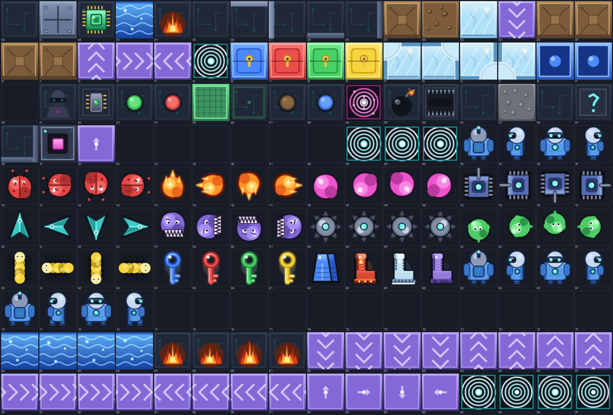

# Circuit Runner

Ein kachelbasiertes Puzzle-Spiel im Geist von **Chip's Challenge** (Atari Lynx /
MS), geschrieben in GameBasic. Sammle alle Daten-Chips, dann öffnet der Sockel
den Weg zum Ausgang — weiche Wasser, Feuer und Robotern aus, nutze Schlüssel,
Stiefel und schiebbare Blöcke.

> **Eigenständig, aber kompatibel.** Eigener Name und eigene Neon-Circuit-Grafik
> (kein Original-Artwork nachgezeichnet), aber **kompatibel mit dem originalen
> Levelformat** — heruntergeladene Fansite-Levelsets (`.dat`/`.ccl`, wie sie
> *Tile World* / *CCEdit* nutzen) lassen sich konvertieren und spielen.



## Spielen

```
gbrun.py circuitrunner\circuitrunner.gb        # oder im Editor F5
```

Läuft im **randlosen Vollbild**. Im Menü mit den Pfeiltasten ein **Level-Set**
wählen, mit LEER/ENTER starten.

| Taste | Wirkung |
|---|---|
| Pfeile / WASD | bewegen + schieben |
| LEER / ENTER | bestätigen / weiter |
| R | Level neu starten |
| N | Level überspringen (Entwicklung) |
| P | Passwort eingeben → Level anspringen (Menü/Intro) |
| M | Musik an/aus |
| F1 / F2 | Musik leiser / lauter |
| F3 / F4 | Effekte leiser / lauter |
| F5 | Lösung aufzeichnen (nochmal = beenden) |
| F6 | aufgezeichnete Lösung abspielen |
| ESC | zurück / Menü |

Ein **Gamepad** ist gleichwertig belegt: Steuerkreuz bewegt, **A**/**Start**
bestätigt, **B** geht zurück, **Y** startet den Level neu. Beim Sterben und beim
Erreichen des Ausgangs rüttelt es kurz.

### Lösungen aufzeichnen (F5/F6)

Ein hartes Level einmal geschafft und beim nächsten Mal nicht mehr gewusst, wie?
**F5** startet den Level neu und schreibt ab da jede Eingabe mit; erreichst du
den Ausgang, landet die Runde als `loesung_<set>_<level>.txt` neben dem Spiel.
**F6** spielt sie wieder ab — die Figur läuft die Lösung von selbst. Jede echte
Taste bricht die Wiedergabe ab und du übernimmst.

Aufgezeichnet wird die **Eingabe**, nicht der Ablauf. Damit dieselben Tasten
auch dasselbe Ergebnis liefern, startet F5 und F6 den Level neu, nageln den
Zufall auf denselben Startwert (Zufalls-Laufbänder und Blobs würfeln!) und
rechnen für die Dauer der Aufnahme/Wiedergabe in **Bildern statt Sekunden** —
sonst fiele ein Zug je nach Bildrate mal in den einen, mal in den nächsten
Spielschritt. Eine Aufnahme gilt darum immer nur für **das Level, in dem sie
entstand**; stirbst du, wird sie verworfen.

**Fortschritt & Bestzeiten** werden in `circuitrunner.save` (neben dem Spiel)
gesichert: pro Level die schnellste Lösungszeit (im HUD, Intro und Sieg-Overlay
angezeigt, „NEUER REKORD!" bei Verbesserung), pro Set das höchste erreichte
Level. Mit **P** ein 4-Buchstaben-Passwort eines Levels eintippen, um direkt
dorthin zu springen (Fansite-Sets bringen Passwörter mit; Demo-Set nicht).

## Eigene & heruntergeladene Level

Das Spiel scannt beim Start **alle `*.json`-Sets** in `levels/` und
`levels/_downloaded/` und bietet sie im Menü zur Auswahl an.

### Fansite-Sets (.dat / .ccl) konvertieren

Lade ein Set von einer Fansite (z. B. die frei verteilbaren *Chip's Challenge
Level Packs* CCLP1–5 von [bitbusters.club](https://bitbusters.club/)) und wandle
es um:

```
py circuitrunner\convert_dat.py  pfad\zu\CCLP1.dat
```

Das schreibt `levels/CCLP1.json` (bzw. nach `levels/_downloaded/`, wenn dort
abgelegt) — beim nächsten Start erscheint das Set im Menü.

> Heruntergeladene Sets bitte in `levels/_downloaded/` ablegen (ist
> gitignoriert, da urheberrechtlich geschützt — nur die Daten der jeweiligen
> Autoren, nicht in diesem Repo enthalten).

### Eigene Level bauen

`make_demo_levels.py` erzeugt die mitgelieferten Demo-Level aus ASCII-Karten —
eine einfache Vorlage für eigene Sets. Jedes Level wird beim Bau **validiert**
(Flood-Fill: alle Chips/Schlüssel erreichbar, Ausgang nur über den Sockel) —
so können keine unlösbaren Level entstehen:

```
py circuitrunner\make_demo_levels.py     # -> levels/circuit_runner.json
```

## Grafik (64×64, supersampled)

Alle Kacheln werden **programmatisch** erzeugt (`make_tiles.py`, PIL) in ein
Master-Sheet `assets/tiles.png` (16×8 Zellen à 64 px; intern 4× supersampled
und kantengeglättet gezeichnet — detailliert/farbig statt flach 8-bit), in dem
die **Zellen-Position dem Tile-Code entspricht** (0x00–0x7F). Die Engine
zeichnet jede Kachel/Figur per `DRAWIMAGEPART(sheet, code)`.

```
py circuitrunner\make_tiles.py
```

Zusätzlich wird `assets/tiles.gbsprite` exportiert (**im Sprite-Editor
`gbsprites` zu öffnen und bearbeiten** — jede Kachel ein benannter Frame). Die
HUD-Icons zeichnet die Engine direkt aus dem Sheet (`DRAWIMAGEPARTEX`), skaliert
in nativer Auflösung — keine separaten Icon-Dateien.

Gerendert wird zweischichtig: das Spielfeld kommt pixelgenau aus einem
Render-Target (ganzzahlig hochskaliert), HUD/Menü-Text und Icons dagegen in
**nativer Bildschirmauflösung** (TTF-Font `assets/font.ttf`, Skalierung via
`TEXTROT`) — dadurch ist die Schrift gestochen scharf statt klobig.

## Levelformat (JSON-Set)

```jsonc
{ "name": "Circuit Runner", "ruleset": "ms|lynx",
  "levels": [ {
    "title": "...", "number": 1, "time": 0, "chips": 11,
    "hint": "...", "password": "ABCD",
    "width": 32, "height": 32,
    "upper": "<2048 Hex-Zeichen>",   // Ober-Layer: 1024 Tile-Codes
    "lower": "<2048 Hex-Zeichen>",   // Terrain unter Figuren/Blöcken
    "traps":   "bx,by,tx,ty;...",    // Knopf -> Falle
    "cloners": "bx,by,mx,my;...",    // Knopf -> Klon-Maschine
    "monsters":"x,y;..."             // Bewegungsreihenfolge
  } ] }
```

Die Tile-Codes (0x00–0x6F) sind identisch zum originalen Chip's-Challenge-
Objektsatz (siehe `assets/tiles.json` für die Namensliste).

## Mechanik

Voller Satz: Chips + Sockel + Ausgang · 4 Schlüssel & Türen (grün bleibt
erhalten) · Wasser (Flossen) · Feuer (Feuer-Stiefel) · Eis + Eis-Ecken
(Schlittschuhe) · Force-Böden + Zufalls-Force (Saug-Stiefel, Eingabe-Override) ·
schiebbare Blöcke (Block → Wasser = Dreck, → Bombe = Explosion) · Bomben · dünne
Wände & Eckwände · blaue Schein-/Echt-Blöcke · verdeckte Wände · Pass-once ·
Dieb · Teleporter · Toggle-Wände + grüner Knopf · Tanks + blauer Knopf · Cloner +
roter Knopf · Fallen.

**9 Monstertypen** mit eigener KI: Käfer (linke Wand), Paramecium (rechte Wand),
Gleiter, Feuerball, Ball (Bounce), Tank, Walker (Zufall bei Block), Blob
(Zufall), Teeth (Verfolger). Monster ziehen mit Spielertempo und in der
MS-Bewegungsreihenfolge der Levelliste (CCLP1-treues Timing); Teeth & Blob
bewegen sich halb so schnell wie die übrigen Monster.

**Animierte Kacheln** (HD-Tileset, 4 Frames je ~130 ms, Sheet-Zeilen 8–13):
Wasser-Wellen, Feuer-Flackern, scrollende Force-Rollbänder, pulsierender Ausgang,
Teleporter-Wirbel, Bomben-Funke, energetische Toggle-Wände, Sockel-Energiekern,
Cloner-Maschine, **flackernder Dieb sowie schimmernde Schlüssel und Stiefel**
(pulsierender Glow-Halo + Funkeln). Neue animierte Kachel: in `make_tiles.py`
einen `frame`-Parameter ergänzen und in die `anim`-Liste aufnehmen (Frames ab
Zelle 160), dann `anim_base()` in der Engine erweitern.

## Dateien

| Datei | Zweck |
|---|---|
| `circuitrunner.gb` | die Spiel-Engine (GameBasic) |
| `make_tiles.py` | Tileset-Generator → `assets/tiles.png` + `.gbsprite` |
| `convert_dat.py` | `.dat`/`.ccl` → JSON-Set (echte Fansite-Level) |
| `make_demo_levels.py` | ASCII → `levels/circuit_runner.json` (5 Demos) |
| `levels/*.json` | Level-Sets (im Menü wählbar) |

Tests: `tests/test_circuitrunner.py` (Konverter-Round-Trip + Demo-Schema +
gbrt-Headless-Harness für Monster-Reihenfolge/-Tempo, Bestzeiten und Passwort).

## Grenzen / Ideen

- Bestzeit: getimte Level werten die übrige Zeit (CC-Zeitbonus), ungetimte die kürzeste verbrauchte Zeit.
- Aufgezeichnete Lösungen (F5/F6) sind an Level **und** Levelset gebunden; ein geändertes Level macht die Aufnahme wertlos (sie läuft dann einfach ins Leere).
- Monster-Bewegungsreihenfolge innerhalb eines Ticks folgt der `monsters`-Liste; ungelistete Monster werden in Lese-Reihenfolge ergänzt (bei extrem timing-präzisen Puzzles möglich, dass Sonderfälle minimal abweichen).

## Sound & Musik

**Soundeffekte:** Kenney „Interface Sounds"
([kenney.nl](https://kenney.nl/assets/interface-sounds)), Lizenz **CC0 1.0**
(Public Domain, keine Attribution nötig) — als WAV in `assets/sfx/` eingecheckt.
Fehlt der Ordner, fallen die Effekte auf prozedurale Synth-Töne zurück.
Aktualisieren: `python circuitrunner/download_sfx.py`.

**Hintergrundmusik:** nahtlos loopende CC0-Chiptunes von **Juhani Junkala**
([archive.org](https://archive.org/details/JuhaniJunkalafiveactionchiptunes),
CC0 1.0) als OGG in `assets/music/`: Titel-Loop in den Menüs, drei Level-Loops
die **pro Level rotieren** (`level1..3`, `cur_level MOD 3`) für Abwechslung, und
ein Ending-Track, wenn alle Level geschafft sind. Mit **M** an/aus, Lautstärke
`MUS_VOL` in der `.gb`. Fehlt der Ordner, läuft das Spiel still weiter.
Aktualisieren: `python circuitrunner/download_music.py`.

**Lautstärke:** im HUD (rechtes Panel) gibt es während des Spiels zwei Slider
„Musik" und „Effekte" — getrennt regelbar über die Audio-Busse
(`AUDIO_BUS_VOLUME`), live ohne Neustart, per **Maus** oder Tastatur (**F1/F2**
Musik, **F3/F4** Effekte, je ±10 %). Mit **M** lässt sich die Musik ganz
stummschalten.

## Lizenz / Hinweis

Grafik und Code sind eigenständig. „Chip's Challenge" ist eine eingetragene
Marke der jeweiligen Rechteinhaber; dieses Projekt ist ein unabhängiger Klon
und nicht damit verbunden. Heruntergeladene Levelsets gehören ihren Autoren.
Soundeffekte: Kenney (CC0), siehe `assets/sfx/CREDITS.txt`. Musik: Juhani
Junkala (CC0), siehe `assets/music/CREDITS.txt`.
