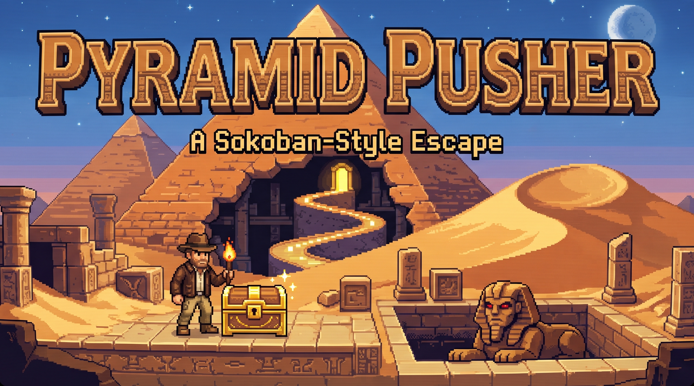

# Pyramid Pusher — *A Sokoban-Style Escape*

Ein Sokoban-Puzzlespiel im Grabkammer-Setting, geschrieben in **GameBasic**.
Schiebe die Ankh-Kisten auf die leuchtenden Zielfelder. Ist eine Kammer
gelöst, springt die Schatztruhe auf und zeigt den **Code** zur nächsten Kammer.



## Starten

```
.venv\Scripts\python.exe gbrun.py pyramid_pusher\pyramid_pusher.gb
```

…oder im **GameBasic-Editor** öffnen und **F5** drücken (läuft nativ über dhrt).

> Grafik startet nur mit echtem OpenGL-Kontext — also aus dem Editor / per
> `gbrun.py`, nicht aus einer headless-Shell.

### Vollbild / Fenster

Standardmäßig läuft das Spiel im **randlosen Vollbild** (`SCREEN_NATIVE` in
nativer Monitor-Auflösung; die Szene wird logisch in 960×600 gerendert und
seitenverhältnis-treu mit Letterbox hochskaliert — kein exklusiver Vollbild-
Modus, also Alt-Tab-freundlich). Umschalten oben in der Datei:

```basic
CONST FULLSCREEN = TRUE    ' FALSE = normales 960x600-Fenster
```

## Steuerung

| Taste | Wirkung |
|---|---|
| **Pfeile / WASD** | Bewegen + Kisten schieben |
| **U** / **Z** | Letzten Zug zurücknehmen (beliebig oft) |
| **R** | Kammer neu starten |
| **H** | Hinweis — markiert die nächste sinnvolle Kiste + Schubrichtung (Solver) |
| **F** | Fackel-Dunkelmodus an/aus |
| **M** | Hintergrundmusik an/aus |
| **L** | Schatzkarte (Kapitel-Auswahl) |
| **T** | Bestenliste & Statistik |
| **C** | Code-Schloss (Code eingeben → direkt zur Kammer springen) |
| **LEER / ENTER** | Bestätigen |
| **ESC** | Zurück / Menü / Beenden |

## Politur

- **Sanftes Gleiten**: Figuren rutschen weich zwischen den Feldern (Render-
  Interpolation, die Logik bleibt rasterbasiert).
- **Sterne-Wertung**: pro Kammer 1–3 Sterne nach Schub-Effizienz (Vergleich mit
  einer unteren Schub-Schranke); der beste Wert wird gespeichert und in der
  Level-Auswahl angezeigt.
- **Ambiente**: dezente prozedurale Musik (antike Tonleiter) + schwebender Staub.
  Legst du eine `assets/ambient.xm` ab, wird stattdessen dieses Tracker-Modul
  geloopt. Stummschalten mit **M**.

## Truhe & Code-System

- Nach jeder gelösten Kammer öffnet sich die **Truhe** und zeigt den 4-Buchstaben-Code
  der nächsten Kammer (z. B. `DABA`).
- Der Fortschritt wird **automatisch gespeichert** (`pyramid_pusher.save`) — du
  verlierst deinen Platz nie.
- Zusätzlich kannst du jederzeit über das **Code-Schloss** (Taste **C**) einen
  Code eingeben und direkt zu dieser Kammer springen (klassisches Passwort-Prinzip).
- Pro Kammer wird die **beste Zugzahl** gespeichert; ein neuer Rekord wird gefeiert.

## Level (`.xsb` / `.sok`)

Alle Level liegen als **Standard-XSB-Textdateien** im Ordner [`levels/`](levels).
Beim Start werden **alle** `.xsb`/`.sok`-Dateien dieses Ordners (alphabetisch)
eingelesen und aneinandergehängt.

Das XSB-Format:

```
#  Wand          (Leerzeichen)  Boden (innen)
@  Spieler       $  Kiste
.  Zielfeld      *  Kiste auf Zielfeld
+  Spieler auf Zielfeld
;  beginnt eine Titel-/Kommentarzeile

Bonus-Mechaniken (eigene Format-Erweiterung):
H  Sand-Loch (Spieler blockiert; Kiste hinein -> gefuellt = begehbar)
I  Eisplatte (Spieler rutscht in Laufrichtung bis zur naechsten Wand/Kiste)
B  Schalter   D  Tuer  (alle Schalter belegt -> alle Tueren offen)
```
Level werden durch eine **Leerzeile** getrennt; die Kommentarzeile direkt davor
liefert den Kammer-Titel.

**Mitgeliefert (382 Kammern):**

- `01_pyramid_pusher.xsb` — 12 selbst entworfene Tutorial-Kammern (frei verwendbar),
  jede vom Solver auf Lösbarkeit geprüft.
- `02_skinner_classics.xsb` — **366 klassische Level von David W. Skinner**
  (*Microban I–V*, *Sasquatch I–XI*), frei verteilbar bei Namensnennung. Aus dem
  öffentlichen sourcecode.se-Spiegel geholt und ins Titel-vor-Brett-Format
  konvertiert (`levels/_authoring/convert_skinner.py`, Rohdaten unter
  `levels/_authoring/source/`).
- `03_bonus_demo.xsb` — 4 Demo-Kammern für die Bonus-Mechaniken (Loch/Eis/
  Schalter+Tür), lösungsgeprüft (`_test_bonus.gb`). Codes: **BILA, DILA, FILA,
  GILA** (per Code-Schloss erreichbar) — oder `CONST DEV_UNLOCK = TRUE` setzen.

### Eigene oder weitere Sätze hinzufügen

Lege einfach eine weitere `.xsb`-Datei in `levels/` — beim Start werden alle
`.xsb`/`.sok`-Dateien alphabetisch eingelesen.

- **Frei verteilbar**: weitere Sammlungen von **David W. Skinner** u. a. — viele
  Fansites/Spiegel bieten sie als `.xsb`/`.txt` an (z. B. sourcecode.se,
  sokobano.de). Herunterladen, in `levels/` ablegen, fertig.
- **Original „Sokoban" (Thinking Rabbit)**: urheberrechtlich geschützt — daher
  **nicht** mitgeliefert. Wer eine lizenzierte/legale Kopie besitzt, kann sie
  lokal als `.xsb` in `levels/` ablegen.

> Hinweis zum Parser: Ein Level darf **keine komplett leere Zeile mitten im
> Brett** haben (leere Zeile = Level-Trenner). Wandbegrenzte Level (Standard)
> sind immer in Ordnung.

## Grafik

Alle Tiles/Sprites liegen als PNG in [`assets/`](assets) (32×32, Held-Sheet
64×128). Erzeugt vom Generator:

```
.venv\Scripts\python.exe pyramid_pusher\assets\gen_art.py
```

Die PNGs sind ganz normale Sheets — du kannst jedes im **Sprite-Editor**
nachmalen:

```
gbsprites pyramid_pusher\assets\hero.png
```

## Level prüfen / erzeugen

Der Autoren-Satz wird mit einem eingebauten **Sokoban-Solver** auf Lösbarkeit
geprüft, bevor er geschrieben wird:

```
.venv\Scripts\python.exe pyramid_pusher\levels\_authoring\make_levels.py
```

## Tests (headless, ohne Grafik)

```
.venv\Scripts\python.exe gbrun.py pyramid_pusher\_test_headless.gb   # Parser + Codes
.venv\Scripts\python.exe gbrun.py pyramid_pusher\_test_logic.gb      # Schieben/Undo/Lösung
```

## Schatzkarte & Kapitel

Die **Level-Auswahl** (Taste **L**) ist eine Schatzkarte im Stil des Titelbilds:
ein gewundener Pfad mit einem **Wegpunkt pro Kapitel** (Tutorial, Microban I–V,
Sasquatch I–XI). Gelöste Kapitel tragen einen goldenen Stern. Ein Wegpunkt öffnet
die Kammern dieses Kapitels.

## Bestenliste & Zeit

Jede Kammer hat einen **Lösungs-Timer** (in der HUD oben). Beim Lösen werden Zeit,
Züge, Schübe und Sterne in einer **SQLite-Bestenliste** (`pyramid_pusher.db`,
`db`-Modul) protokolliert. Taste **T** öffnet **Bestenliste & Statistik**:
Gesamt-Fortschritt (gelöst / Sterne / Perfekt) + die schnellsten Lösungen je Kammer.

## Ideen für später (Roadmap)

Erledigt: Dunkelmodus, sanftes Gleiten, Sterne, Ambiente (Musik+Staub),
Schatzkarte, Bestenliste/Zeit, Bonus-Mechaniken (Loch/Eis/Schalter+Tür),
**Hinweis-System** (Taste **H**: beschränkte Push-BFS, markiert den nächsten
sinnvollen Schub; bei Bonus-Mechaniken/zu komplex meldet es das ehrlich). Offen:

- Am Ende: **Installer neu bauen**, damit alle neuen dhrt-Builtins enthalten sind.

## Lizenz / Credits

- Code, Grafik und der Level-Satz `01_pyramid_pusher.xsb`: eigens für dieses
  Projekt erstellt, frei verwendbar.
- `02_skinner_classics.xsb`: Level © **David W. Skinner** (Microban/Sasquatch),
  frei verteilbar bei Namensnennung — Credit gehört ihm.
- Weitere Level-Sätze unterliegen der Lizenz ihrer jeweiligen Autoren.
